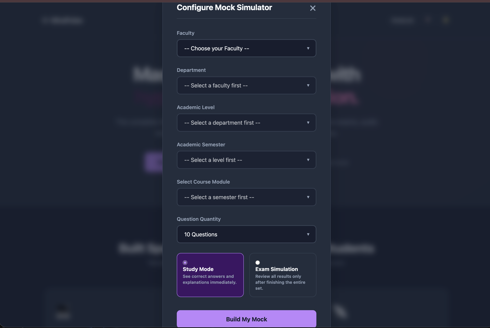
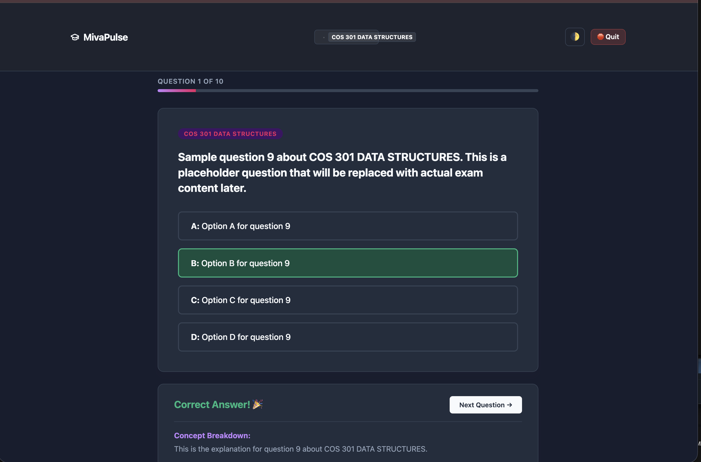
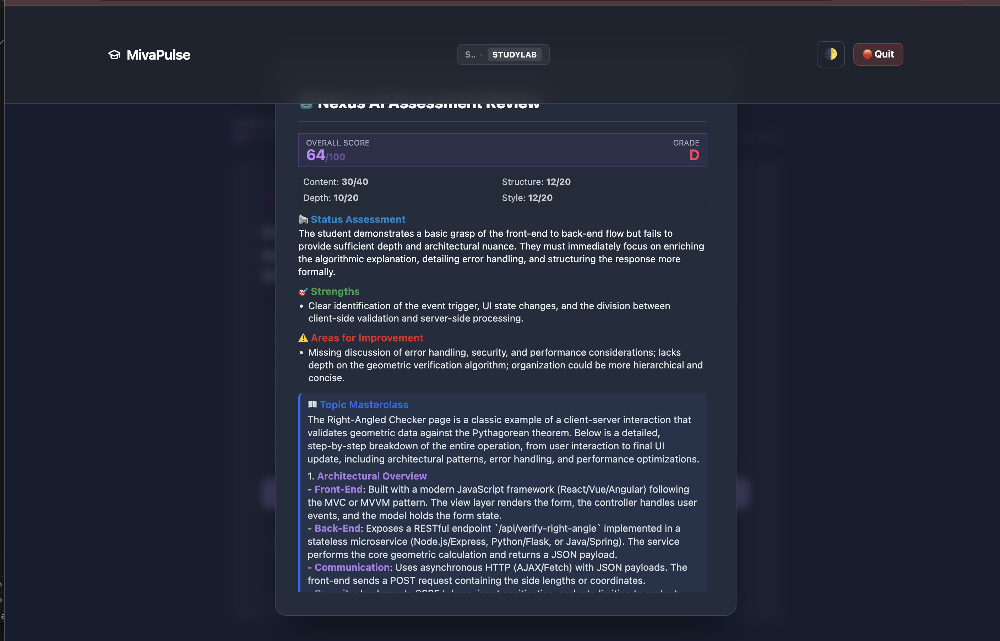
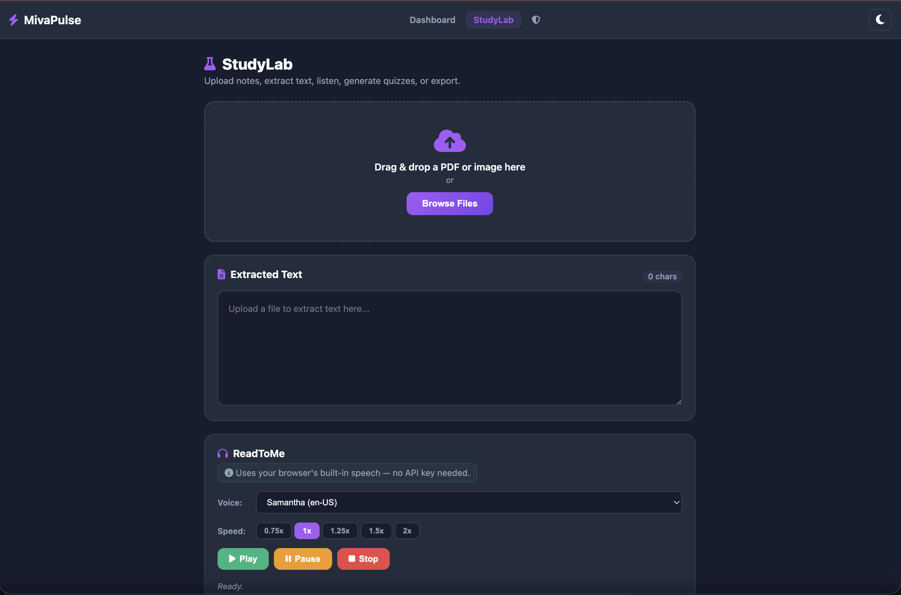

# MivaPulse 🎓

An AI-assisted examination preparation platform for university students. MivaPulse combines multiple-choice practice, AI-powered essay evaluation, a personal study sandbox, and a document-to-quiz generator into a single responsive web app.

> **Original Author:** [Anthony Abah](https://github.com/UncleT-cyber) — [UncleT-cyber/mivapulse](https://github.com/UncleT-cyber/mivapulse)
>
> This project is open source under the [MIT License](LICENSE). If you fork or redistribute this software, you **must retain the original copyright notice** and this attribution. See [COPYRIGHT](COPYRIGHT) for full details.

---

## Screenshots

<div align="center">
  
  <br/><br/>
  
  <br/><br/>
  
  <br/><br/>
  
</div>

---

## Features

### Quiz Engine
- Course-organized MCQ testing across faculties, departments, levels, and semesters
- **Practice Mode** with instant feedback, explanations, and score tracking
- **Exam Mode** simulating timed, no-hint test conditions
- Question shuffling, configurable limits, and progress tracking

### AI Essay Examiner
- Real-time essay evaluation powered by **Groq** cloud AI
- Structured rubric grading: Content (40), Structure (20), Depth (20), Style (20)
- Letter grade, status assessment, strengths, weaknesses, and a topic deep-dive masterclass
- Per-question `key_points_expected` criteria for targeted evaluation

### Study Lab
- Paste any text or upload documents (PDF, DOCX, TXT, images) to generate quiz questions
- AI question extraction via Groq with **Essay Only**, **MCQ Only**, or **Mixed** modes
- Built-in **ReadToMe** browser TTS player with speed controls and voice selection
- Direct launch into quiz mode from generated questions

### Personal Sandbox
- Import questions from any course or from Study Lab-generated sets
- Free-form practice with AI essay evaluation in a personal workspace
- Tracks attempts, scores, and essay submissions

### Admin Panel
- Overview of all courses, question counts, and essay question distribution
- Bulk import/export tools for question bank management

### Dashboard
- Faculty → Department → Level → Semester → Course navigation
- Practice and Exam mode selection with configurable question limits
- Dark/light theme toggle

### Cross-Cutting
- **MathJax v3** rendering for LaTeX formulas and physics equations
- Dark mode with persistent theme preference (localStorage)
- Fully responsive mobile-first UI
- Drag-and-drop and click-to-upload file support
- Custom haptic feedback on supported devices
- Client-side form validation with accessible modal alerts

---

## Tech Stack

| Layer | Technology |
|-------|-----------|
| Frontend | HTML5, CSS3, JavaScript (ES6+) |
| Math Rendering | MathJax v3 |
| AI Backend | Groq API (cloud TTS and essay evaluation) |
| Hosting | Vercel Serverless Functions |
| Data | JSON-based course/question bank |

---

## Project Structure

```
mivapulse/
├── index.html              # Dashboard homepage
├── quiz.html               # Quiz engine (practice + exam)
├── studylab.html           # Study Lab (document → quiz)
├── sandbox.html            # Personal sandbox workspace
├── admin.html              # Admin panel
├── extractor.html          # Document text extractor
├── api/
│   ├── extract-questions.js   # Groq AI question extraction
│   ├── evaluate-essay.js      # Groq AI essay evaluation
│   ├── extract-text.js        # Document text extraction (PDF, DOCX, OCR)
│   ├── export-questions.js    # JSON export endpoint
│   └── v2/                    # Admin auth & contributions API
├── js/
│   ├── app.js               # Dashboard logic
│   ├── quiz-engine.js       # Quiz runtime engine
│   ├── studylab.js          # Study Lab + TTS player
│   ├── sandbox.js           # Sandbox quiz logic
│   ├── admin.js             # Admin panel logic
│   └── extractor.js         # Client-side extraction UI
├── css/
│   ├── main.css             # Global styles + theme
│   ├── quiz.css             # Quiz engine styles
│   ├── studylab.css         # Study Lab styles
│   ├── sandbox.css          # Sandbox styles
│   └── admin.css            # Admin panel styles
├── src/services/
│   └── questionAdapter.js   # Universal question data adapter
├── data/
│   ├── manifest.json        # Faculty/department/level/course registry
│   └── cybersecurity/       # Course question bank JSON files
├── screenshots/             # App screenshots for README
├── vercel.json              # Vercel route config
└── package.json
```

---

## Getting Started

### Prerequisites
- Node.js 18+
- A [Groq API key](https://console.groq.com/keys)

### 1. Clone and install
```bash
git clone https://github.com/UncleT-cyber/mivapulse.git
cd mivapulse
npm install
```

### 2. Configure environment
Create `.env.local` in the project root:
```env
GROQ_API_KEY=gsk_your_groq_api_key_here
```

### 3. Run locally
```bash
npx vercel dev
```
Open `http://localhost:3000` in your browser.

---

## Contributing

1. Fork the repository
2. Create a feature branch (`git checkout -b feature/new-feature`)
3. Commit your changes (`git commit -m "feat: add new feature"`)
4. Push to the branch (`git push origin feature/new-feature`)
5. Open a Pull Request

---

## License

Distributed under the MIT License. See [LICENSE](LICENSE) for details.
